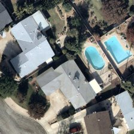
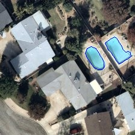
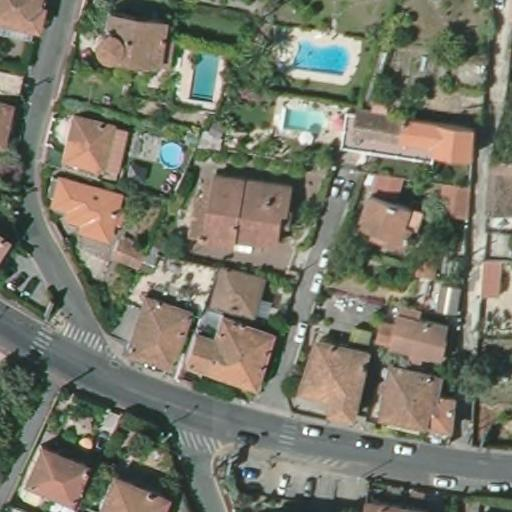
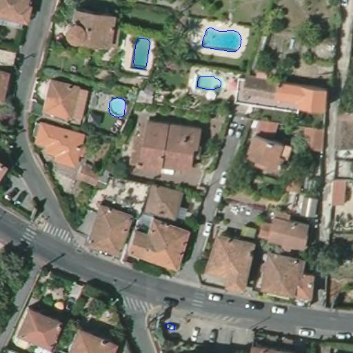

# Pool Detection in Satellite Images

This project focuses on detecting swimming pools from aerial imagery using two different approaches:

OpenCV-based method: Uses traditional image processing techniques.

Deep Learning approach: Utilizes a U-Net model for semantic segmentation.

## Table of Contents

- [Pool Detection in Satellite Images](#pool-detection-in-satellite-images)
  - [Table of Contents](#table-of-contents)
  - [Description](#description)
  - [Project Structure](#project-structure)
  - [Installation Requirements](#installation-requirements)
    - [Prerequisites](#prerequisites)
    - [Installation Steps](#installation-steps)
    - [2. U-Net Deep Learning Approach](#2-u-net-deep-learning-approach)
  - [Results](#results)
    - [1. OpenCV-Based Approach](#1-opencv-based-approach)
    - [2. U-Net Deep Learning Approach](#2-u-net-deep-learning-approach-1)


## Description

This project explores two approaches for detecting swimming pools in satellite images:  

1. **OpenCV-Based Approach**: Uses color segmentation and contour detection to extract pool regions based on their distinctive blue color.  
   
2. **U-Net Deep Learning Approach**: Trains a neural network for semantic segmentation to generate precise pool masks.  

The goal is to develop an efficient method for identifying pools in aerial imagery. The repository includes dataset preprocessing, training scripts, and inference notebooks for both methods. 

## Project Structure

```bash
C:.
├───dataset
│   ├───images      # Original aerial images for training and testing
│   ├───labels      # YOLO-style annotations (bounding boxes) for the images
│   └───masks       # Ground truth segmentation masks for swimming pools
├───model         # Directory to store saved pre-trained models (e.g., U-Net model files)
├───output        # Output folder for processed images, and coordinate files
├───scripts       # CLI scripts for pool detection (both OpenCV-based and U-Net inference)
└───swimming_pool # Sample images used specifically for the OpenCV-based approach

```


## Installation Requirements

### Prerequisites

Ensure you have the following installed before proceeding:

- Python 3.8+
- pip
- Git (for cloning the repository)

### Installation Steps

1. **Clone the Repository**  
   ```bash
   git clone https://github.com/K-Oussama/Swimming-Pool-Detection.git
   cd Swimming-Pool-Detection
   git checkout cli-scripts

2. **Create a Virtual Environment (Recommended)**
    ```bash
    python -m venv venv
    source venv/bin/activate  
    # On Windows use: venv\Scripts\activate

3. **Install Dependencies**
    ```bash
    pip install -r requirements.txt
    ```

## Usage Guide

- Navigate to the `Scripts` folder.

### 1. OpenCV-Based Approach

```bash
python scripts/detect_pool.py --input ../dataset/images/sample.jpg --output output/output_image.jpg --coordinates output/coordinates.txt
```


### 2. U-Net Deep Learning Approach

This method leverages a U-Net model for semantic segmentation of swimming pools.

If the U-Net model is not included in the repository, download it from this link :
[Model - Google Drive ☁](https://drive.google.com/file/d/1XIYaCRQ7pLuBhKo1p04UC0iGu3Qr6Znd/view?usp=sharing)

Run inference on an image:

```bash
python scripts/unet_infer.py --model ../model/unet_model.h5 --input ../dataset/images/sample.jpg --output output/output_image.jpg --coordinates output/coordinates.txt
```


## Results

### 1. OpenCV-Based Approach

The OpenCV approach uses color-based segmentation and contour detection to identify swimming pools in images. The method extracts blue regions, often representing pools, and finds contours to precisely highlight the pool areas.

Here are some examples of the results from the OpenCV-based approach:


<table>
  <tr>
    <td><strong>Input Image</strong></td>
    <td><strong>Detected Pool Contours</strong></td>
  </tr>
  <tr>
    <td></td>
    <td></td>
  </tr>
</table>


<b>Some limitations : </b>
- Highly dependent on pool color (blue). It struggles to detect pools with unusual colors or reflections.

- Sensitive to shadows, lighting conditions, and occlusions, which can lead to false positives or missing detections.

- Cannot accurately determine pool boundaries in cases of similar-colored surroundings, such as blue rooftops or water bodies.

### 2. U-Net Deep Learning Approach

The U-Net approach uses a deep learning model for semantic segmentation, providing more robust and flexible segmentation of swimming pools. This method is able to detect pools regardless of their color and is more resilient to different backgrounds.

Here are some examples of the results from the U-Net approach:

<table>
  <tr>
    <td><strong>Input Image</strong></td>
    <td><strong>Detected Pool with Contours</strong></td>
  </tr>
  <tr>
    <td></td>
    <td></td>
  </tr>
</table>


<b>The model is only trained on a small portion of images out of +800 images due to the cost of ressources and time constraints
PS: The model only works with aerial images that have a similar depth and resolution to those in the dataset</b>

---


🏊‍♂️

